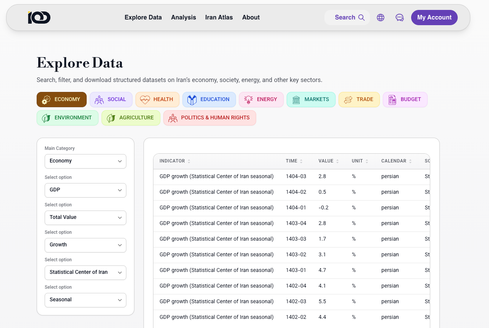

# Iran Open Data Hub
Public demonstration repository of the Iran Open Data (IOD) platform.

## What is this?

Accessing Iranian data has become increasingly difficult.

For months, researchers, journalists, students, and analysts have faced interruptions in access to key statistical sources, including the Statistical Center of Iran and other official data providers. Even when data is available, it is often distributed across multiple websites, reports, spreadsheets, and formats, making systematic analysis time-consuming and difficult.

As a result, users frequently spend more time finding, cleaning, and organizing data than actually analyzing it.

[Iran Open Data (IOD)](https://iranopendata.org/en/dashboard/) was created to address this challenge. 


IOD is an effort to collect, standardize, document, and organize Iranian economic and social statistics within a consistent data model. The goal is to make official data easier to discover, compare, analyze, and visualize.

This repository contains a public demonstration version of the project using a limited sample dataset. The production version contains substantially more indicators, metadata, and historical data and remains private.

The long-term objective is to build a comprehensive and reusable data infrastructure for researchers, journalists, policymakers, students, and anyone interested in understanding Iran through data.




---

## Sample Data Included

This demo includes selected indicators from:

### Macroeconomy

* Gross Domestic Product (GDP)
* Inflation
* Monetary indicators
* Labour market indicators
* Household budget

### Society

* Population
* Vital statistics
* Selected social indicators

The sample is intended to demonstrate the architecture and workflow rather than provide complete coverage.

---

## Architecture

```text
Raw CSV Files
      │
      ▼
load_raw_to_duckdb.py
      │
      ▼
DuckDB Database
      │
      ├── master_en
      ├── master_fa
      ├── geo
      ├── sub
      ├── econ_facts
      │
      ▼
Streamlit Application
```

---

## Folder Structure

```text
iod-data-sample/

├── app.py
├── requirements.txt
├── README.md
│
├── data/
│   ├── raw/
│   │   ├── GDP
│   │   ├── Inflation
│   │   ├── Monetary
│   │   ├── Social
│   │   └── Metadata
│   │
│   └── duckdb/
│       └── iod_dash.duckdb # Pre-built demo database
│
├── src/
│   └── load_raw_to_duckdb.py
│
├── fonts/
│   ├── IRANSans Regular.ttf
│   └── IRANSans Medium.ttf
```

---

## Installation

Clone the repository:

```bash
git clone https://github.com/AliRanjipour/iod-hub-demo.git
cd iod-hub-demo
```

Install dependencies:

```bash
pip install -r requirements.txt
```

Run the application:

```bash
streamlit run app.py
```

The sample DuckDB database is included in this repository, so the application can be run immediately without rebuilding the database.

## Data Model

### Metadata Tables

| Table     | Purpose                   |
| --------- | ------------------------- |
| master_en | English metadata          |
| master_fa | Persian metadata          |
| geo       | Geographic lookup table   |
| sub       | Sub-category lookup table |

These tables define:

* indicator labels
* category hierarchy
* chart types
* access levels
* units
* calendars
* sources
* language-specific descriptions

### Fact Tables

The demo database contains multiple domain-specific fact tables:

* gdp_facts
* inflation_facts
* labour_force_facts
* monetary_facts
* social_facts

Each fact table stores observations linked to metadata through a common `topic_id`.

The loading process combines all domain tables into a unified analytical table:

```sql
econ_facts
```

This table serves as the primary data source used by the Streamlit application.

---

## ETL Pipeline

### Step 1 — Raw Data

Source datasets are stored as CSV files inside the `data/raw` directory.

### Step 2 — Database Build

Run:

```bash
python src/load_raw_to_duckdb.py
```

This script:

* loads metadata tables
* loads geographic lookup tables
* loads all fact tables
* creates the unified `econ_facts` table
* writes everything into DuckDB

### Step 3 — Application

Run:

```bash
streamlit run app.py
```

The application connects to DuckDB and dynamically builds the interface using metadata definitions.

Most dashboard components are metadata-driven rather than hardcoded.

---

## Features

* English and Persian interface
* Metadata-driven navigation
* Multi-level category hierarchy
* Time-series visualization
* Geographic visualization
* Dynamic chart generation
* DuckDB analytical backend
* Streamlit frontend
* Standardized data model
* Unified economic and social statistics

---

## Production vs Demo

This repository contains only a small sample of the full IOD platform.

The production version includes:

* substantially more indicators
* broader historical coverage
* additional data domains
* expanded metadata
* user authentication
* subscription-controlled datasets
* download services
* automated update workflows

---

## Technology Stack

* Python
* DuckDB
* Streamlit
* Pandas
* Altair
* Folium

---

## Project Status

The project is under active development as part of the broader Iran Open Data initiative.

Its long-term goal is to provide a structured, transparent, and reusable foundation for working with Iranian economic and social statistics.
